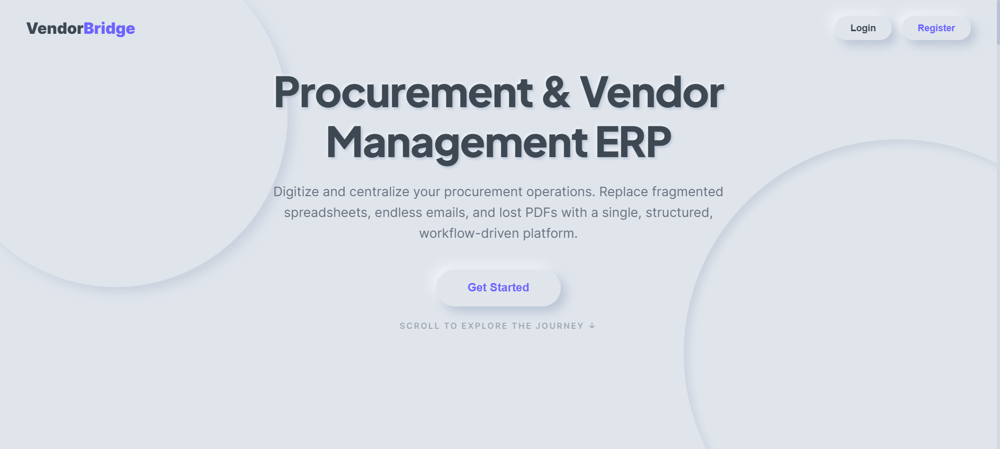
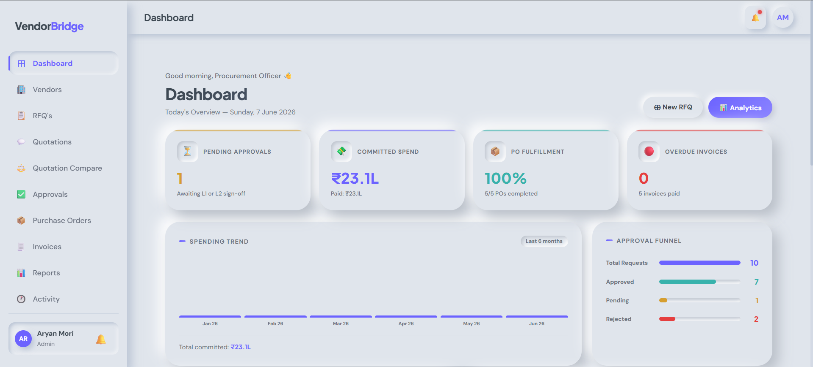
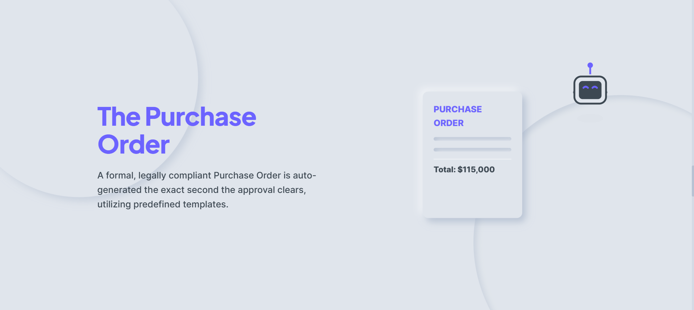
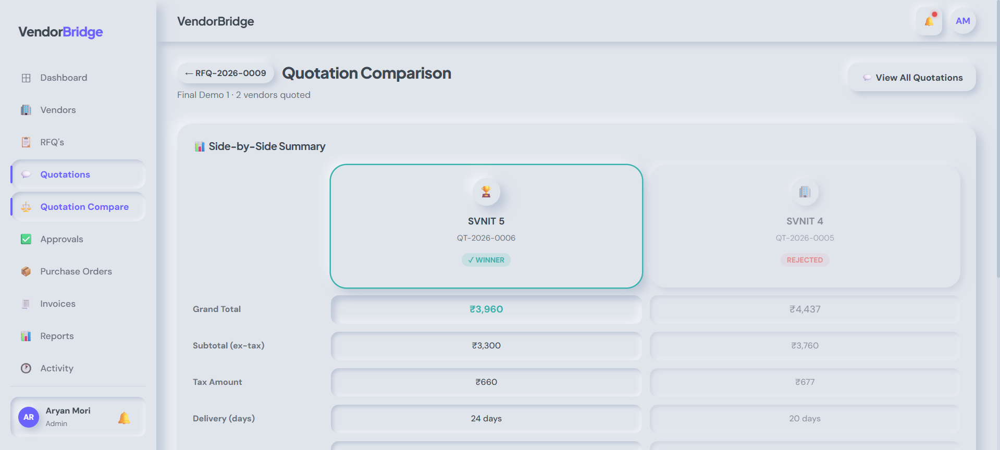
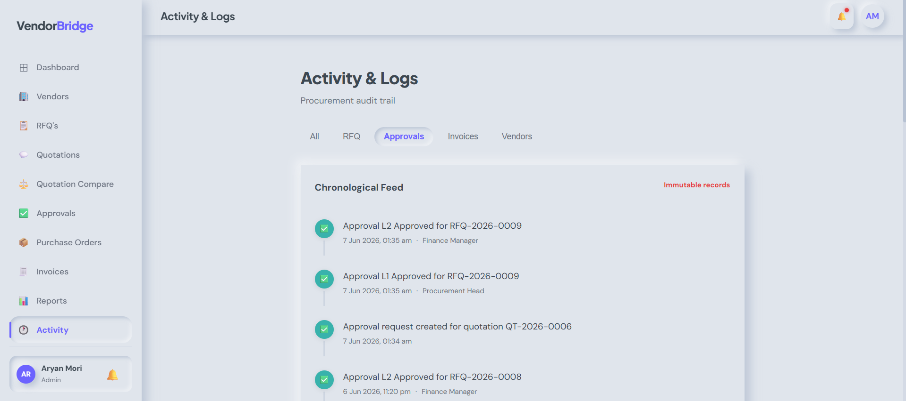
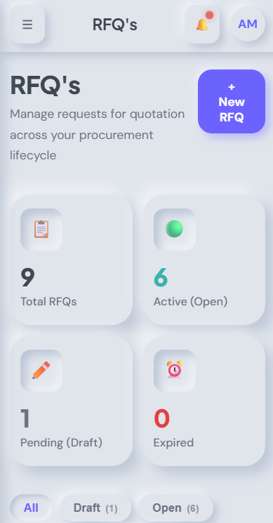
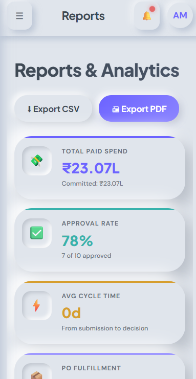

# VendorBridge — Procurement & Vendor Management System

> 🚀 Built for the **Odoo x KSV Hackathon 2026**.
<div align="center">
  
</div>

## 📅 Event Details
- **🏆 Hackathon:** Odoo x KSV Hackathon 2026
- **💻 Round:** Virtual Round — 06 June 2026 (9:00 AM to 5:00 PM, 8 Hrs)
- **🎯 Problem Statement:** VendorBridge
- **👨‍🏫 Evaluator / Mentor:** Ansari Mahamadasif Anvarali (maan) • [GitHub](https://github.com/maan-odoo) • maan@odoo.com

## 👥 Team
- **Aryan Mori** (Team Leader)
- **Vinay Patel**
- **Abhimanyu Kumar**
- **Md Aftab**

---

## 📱 System Screenshots

<div style="display: flex; gap: 10px; overflow-x: auto;">
  
  
  
  
  
  
</div>

---

## 📖 The Story Behind This

We chose procurement to digitize messy, manual workflows with a single, structured platform. Our college faced this exact issue: endless WhatsApp quotes, scattered Excel sheets, and lost paper approvals. 

VendorBridge is our solution. A full-stack web application handling the entire procurement lifecycle—from registering vendors to approving purchases and generating invoices. No shortcuts, just real business logic! 💼

---

## 🎯 What it Solves

Small and medium organizations struggle to answer basic questions like:
- "How much did we spend last month?" 💸
- "Who gave the cheapest quote?" 📉
- "Who approved this purchase?" ✅

VendorBridge puts all this in one place. Every action leaves a record. No approvals happen without following the right chain.

---

## 👤 User Roles

Four distinct roles with enforced backend permissions:
- **🕵️ Procurement Officer** — Creates RFQs, assigns vendors, compares quotes, and selects winners.
- **🏢 Vendor** — Receives RFQs, submits pricing, and updates quotes before deadlines.
- **👔 Manager / Approver** — Reviews quotations and approves/rejects purchases (L1/L2).
- **⚙️ Admin** — Manages users, monitors the system, and accesses reports.

---

## 🔄 The Procurement Lifecycle

```text
Register Vendors ➡️ Create RFQ ➡️ Assign Vendors ➡️ Submit Quotations ➡️ Compare Quotes ➡️ Select Winner ➡️ Approval (L1/L2) ➡️ Purchase Order ➡️ Invoice
```
No stage can be skipped. The database layer enforces all business constraints! 🔒

---

## 🛠️ Tech Stack

We kept it fast, clean, and straightforward:
- **Backend:** 🟢 Node.js + Express
- **Database:** 🍃 MongoDB + Mongoose (Aggregations used heavily)
- **Auth:** 🔐 Stateless JWT + httpOnly Cookies
- **Frontend:** ⚛️ React 18 + Vite + Vanilla CSS (Custom Neumorphic UI)

---

## 🚀 How to Run Locally

You'll need **Node.js (v18+)** and a **MongoDB connection string**.

```bash
# 1️⃣ Install & Run Backend (Port 5000)
cd backend
npm install
npm run dev

# 2️⃣ Install & Run Frontend (Port 5173)
cd ../frontend
npm install
npm run dev
```

*(Create a `.env` in `backend/` with `PORT`, `MONGODB_URI`, `ACCESS_TOKEN_SECRET`, `REFRESH_TOKEN_SECRET`, `CORS_ORIGIN=http://localhost:5173`)*

---

## 💡 What We Learned

- **Real Domain Knowledge:** Implementing actual procurement rules was the biggest challenge. Understanding *why* a rule exists makes the code significantly better.
- **MongoDB Aggregations:** Powerful but unforgiving. One typo can break the entire pipeline.
- **JWT Security:** Short-lived access tokens with `httpOnly` refresh cookies add real, meaningful security to web apps. 🛡️

---

## 📜 License
Made with ❤️ by Team Four Stack Devs
